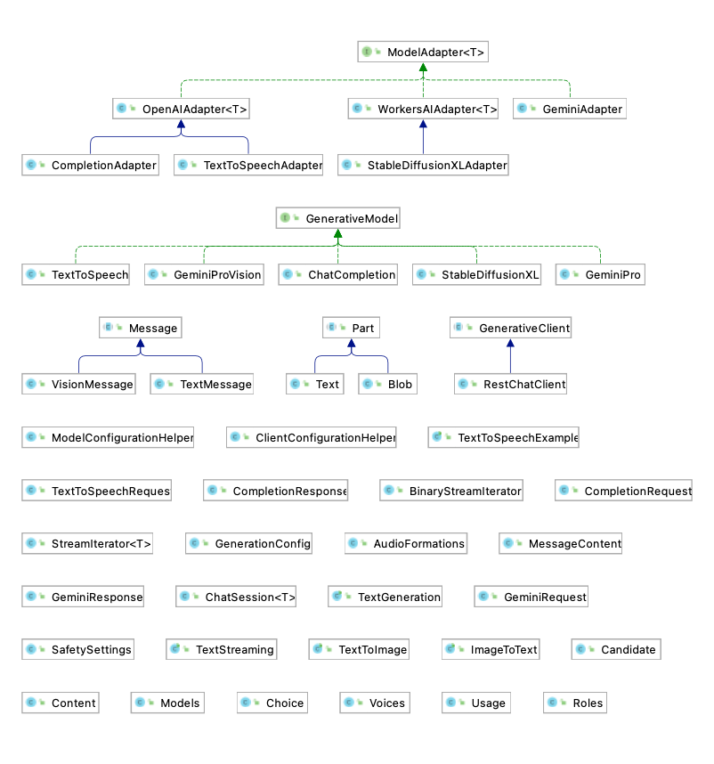

# Alias generative-ai-java

Aiyou is a universal AI chatbot SDK.

This project was inspired Google Generative AI SDK.


## Supported Model

### Google Gemini

1. gemini-pro  
   - text generation
   - streaming
   - functionCalling
2. gemini-pro-vision
3. embedding

### OpenAI

1. chatCompletion
   - text generation
   - streaming
2. text-to-speech

### CloudFlare WorkersAI (Open Source Models)

1. StableDiffusionXL-1.0

## Import

### Maven

````
<dependency>
<groupId>org.eu.miraikan</groupId>
<artifactId>aiyou-sdk</artifactId>
<version>0.20</version>
</dependency>
````

### Gradle
````
implementation group: 'org.eu.miraikan', name: 'aiyou-sdk', version: '0.20'
````
## Usage

Check example code for detail

### Config restClient


Create restClient instance. Config URL and API_KEY via setClientConfig

```java
Map<String,String> clientConfig;
RestChatClient client = new RestChatClient();
```

### Create GenerativeModel

Use model name to specify.  
```java
GeminiPro model = new GeminiPro(client, Models.GEMINI_1_0_PRO_LATEST);
```
### Build request
```
    generativeRequest
        .setContent(new Content(ROLE_USER, new Text(input)))
        .setGenerationConfig(ModelConfigurationHelper.createGeminiModelConfig()); 
```
### Handling response
```
Iterator<GeminiResponse> iterator = model.generateStreamContent(generativeRequest);

while (iterator.hasNext()){
    Text text1 = (Text) iterator.next().getCandidates().get(0).getContent().getParts().get(0);
    System.out.print(text1.getData());  
}
```
### Function
Define function argument


```java
public static  class MovieAndTheater{
    @JsonPropertyDescription("Any movie title")
    public String movie;
    @JsonPropertyDescription("The city and state, e.g. San Francisco, CA or a zip code e.g. 95616")
    @JsonProperty(required = true)
    public String location;
}
```
Declare function with helper
```java
    FunctionDeclaration functionDeclaration = functionCallingHelper
        .addFunction("find_theaters",MovieAndTheater.class, (MovieAndTheater movieAndTheater) -> fakeResponse)
        .setDescription("find movie titles currently playing in theaters based on any description, genre, title words, etc."); 
```
Async Execute functionCall from response 
```java    
CompletableFuture<Object> message = functionCallingHelper.executeAsync(functionCall.getName(), functionCall.getArgs());
```
### Customize

To add a model, create its own request and response template, that may consist of existing supported types     
Each model has own modelAdapter, which handle most input and output logic.


## Key abstraction

- GenerativeClient  

    Wrapper for clients supporting different protocols, mostly RestChatClient.
     
    

- GenerativeModel

    Represent a LLM.


- ModelAdapter

    Handle model's input and output formation.  


- StreamIterator   

    Provides convenient synchronized streaming support, each call return text or binary chunk. 

## Architecture       


## Dependencies

Json Schema lib introduce SLF4J-API, so a logging implementation is required.


## Route Map

Websocket client, maybe Bidirectional stream for audio

Support more models, and platform like Azure. 

Looking forward to Sora official release.

