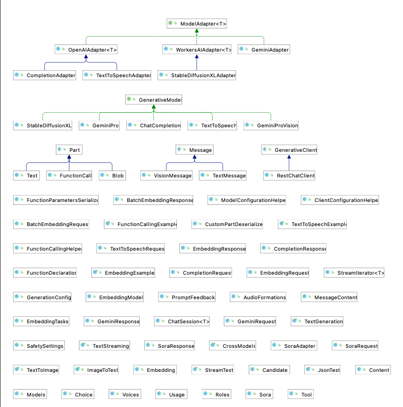

# Aiyou 

Aiyou is a universal AI chatbot SDK, far from product ready yet.

This project was inspired Google Generative AI SDK.

It was just an attempt to fill the gap in the Java platform Originally.

Currently, it supports parts of basic functionalities of Google Gemini, OpenAI, and CloudFlare's WorkAI.

## Document

### Architecture

### Example

Use Gemini Pro for text generation

    RestChatClient client = new RestChatClient();

    client.setClientConfig(ClientConfigurationHelper.createGeminiClientConfig());

    GeminiPro model = new GeminiPro(client);  

    GeminiRequest generativeRequest = new GeminiRequest();

    Text text = new Text("Hello World");

    generativeRequest.setContents(List.of(new Content(
        ROLE_USER,List.of(text)
    )));

    GeminiResponse generativeResponse = model.generateContent(generativeRequest);

    Text text1 = (Text) generativeResponse.getCandidates().get(0).getContent().getParts().get(0);    
    System.out.println(text1.getData());

### Key abstraction

- GenerativeClient  

    Wrapper for clients supporting different protocols, mostly RestChatClient.
     
    

- GenerativeModel

    Represent a LLM.

- ModelAdapter

    Handle model's input and output formation.  

- StreamIterator   

    Provides convenient synchronized streaming support, each call return text or binary chunk. 
       

### Draw back for now

It throws exceptions as possible, and no logging support.

Since Gemini streaming does not follow server-sent events, implementation is a bot roughly.

## Coming soon

Support more models, and platform like Azure

Advanced feature, function calling and embedding 

Websocket client, maybe Bidirectional stream
